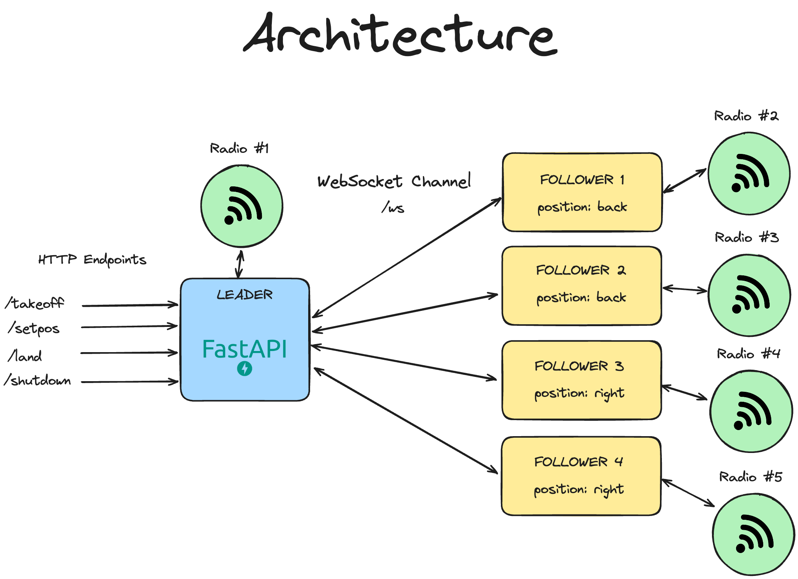

# Crazyflie Leader Follower System
This is an implementation of a leader follower system based on a linear consensus protocol for maintaing formation.

Built under the mentorship of **Dr. Vishwesh A. Vyawahare** &  **Ms. Ritika Thusoo**  @ **Robotics Lab, Ramrao Adik Insitute of Technology.**

## demo video
https://github.com/kry0sc0pic/crazyflie-leader-follower/assets/62088268/18e3fd72-d914-49a9-a701-8d73c8f2a171


## how does it work?
- Each follower drone is assigned a transform function that calculates its position based on the leader's position.
- The Leader Drone is controlled via the operator via a REST API.
- The Leader Drone communicates command and it's position via the websocket which all followers have subscribed to.
- The followers receive the leader's position and calculate their own position based on the transform function and execute it.




## how do I use it?
***IMPORTANT:*** You will need to have as many crazyradio dongles as the number of drones you want to control.

### setup 
**(optional) create virtual environment using python3.8**
```bash
# using conda
conda create -n lfdemo python=3.8

# using venv
python3.8 -m venv venv

```

**Activate Environment**
```bash
# using conda
conda activate lfdemo

# using venv
source venv/bin/activate
```

**install dependencies**
```bash
pip install -r requirements.txt
```

### running the system

**1. Start the Leader Server**
```bash
python leader.py <LEADER_URI>
```

Replace `<LEADER_URI>` with the URI of the leader drone. For example, `radio://0/80/2M/E7E7E7E7E7`

Wait until the server is started. You should see a message like this:
```
INFO:     Uvicorn running on http://0.0.0.0:8000 (Press CTRL+C to quit)
```

**2. Start the Follower Server**
_you can repeat this for each follower you want to add to the swarm_
```bash
python follower.py <FOLLOWER_URI> <TRANSFORM_FUNCTION>
```

Replace `<FOLLOWER_URI>` with the URI of the follower drone. For example, `radio://1/20/2M/E7E7E7E7E7`
Replace `<TRANSFORM_FUNCTION>` with the function name from `formations/__init__.py`. Refer to the resources section for creating your own transform functions.

### example
5 drones with ids 10-50, 10 being the leader and the rest being followers. 
```bash
# Terminal 1 (leader)
python leader.py radio://0/10/2M/E7E7E7E7E7

# Terminal 2 (follower 1 - right position)
python follower.py radio://1/20/2M/E7E7E7E7E7 right

# Terminal 3 (follower 2 - left position)
python follower.py radio://2/30/2M/E7E7E7E7E7 left

# Terminal 4 (follower 3 - behind position)
python follower.py radio://3/40/2M/E7E7E7E7E7 behind

# Terminal 5 (follower 4 - front position)
python follower.py radio://4/50/2M/E7E7E7E7E7 front
```

## resources
### creating a transform function
All the transform functions are defined in `formations/__init__.py`. You can create your own transform function by adding a new function to the file.

Here is an example of a transform function that calculates the position of a drone to be in diagonally in the front to the right of the leader drone.
```python
def front_right(leader_position: dict):
    new_position = {
        'x': leader_position['x'] + 1,
        'y': leader_position['y'] + 1,
        'z': leader_position['z']
    }
    return new_position
``` 

### endpoints
1. Take Off
```
POST http://localhost:8000/takeoff
```
This will make the leader and all connected followers take off to a height of 1 meters.

2. Land
```
POST http://localhost:8000/land
```
This will make the leader and all connected followers land.

3. Set Position
```
POST http://localhost:8000/setpos
{
    "x": 1,
    "y": 1,
    "z": 1
}
```
This will set the leader drone's position to the specified coordinates. The followers will adjust their positions accordingly.

4. Shutdown
```
POST http://localhost:8000/shutdown
```
This should be run after the drones are landed. This will close the links between the server and drones.
